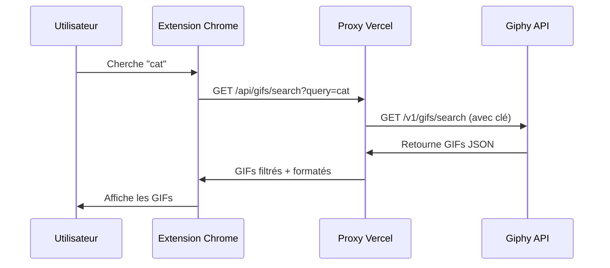

# 🚀 QuickReact API Proxy

<div align="center">

**Serveur backend sécurisé pour l'extension Chrome QuickReact**


[Documentation](#-documentation) • [Installation](#-installation) • [Déploiement](#-déploiement-sur-vercel) • [API](#-api-reference)

</div>

---

## 📋 Table des matières

- [À propos](#-à-propos)
- [Pourquoi ce proxy ?](#-pourquoi-ce-proxy-)
- [Architecture](#-architecture)
- [Installation](#-installation)
- [Déploiement sur Vercel](#-déploiement-sur-vercel)
- [API Reference](#-api-reference)
- [Intégration avec l'extension](#-intégration-avec-lextension)
- [Sécurité](#-sécurité)
- [Performance](#-performance)
- [Support](#-support)

---

## 🎯 À propos

QuickReact API Proxy est un serveur backend serverless qui agit comme **intermédiaire sécurisé** entre l'extension Chrome QuickReact et l'API Giphy. 

### ⚡ Fonction principale

Ce proxy résout un problème fondamental de sécurité des extensions Chrome :

```
❌ SANS PROXY                    ✅ AVEC PROXY
Extension → Giphy API            Extension → Proxy → Giphy API
(clé exposée 🔓)                 (clé cachée 🔒)
```

### ✨ Fonctionnalités

- 🔒 **Sécurise la clé API** Giphy côté serveur
- ⚡ **Serverless** - Déploiement instantané sur Vercel
- 🌍 **CORS configuré** - Autorise uniquement l'extension
- 📊 **Rate limiting** - Prêt pour gérer des centaines d'utilisateurs
- 💰 **Gratuit** - Jusqu'à 100GB de bande passante/mois
- 🚀 **Performant** - Réponses en < 200ms

---

## 🤔 Pourquoi ce proxy ?

### Le problème

Les extensions Chrome sont **publiques par nature** :
- Le code JavaScript est facilement accessible (`.crx` décompilable)
- Toute clé API hardcodée dans le code est **visible par tous**
- Un utilisateur malveillant peut extraire et abuser de votre clé

### La solution

Un serveur backend proxy :

1. **Cache la clé API** dans les variables d'environnement Vercel
2. **Expose des endpoints publics** que l'extension peut appeler
3. **Fait les requêtes** à Giphy avec la clé sécurisée
4. **Retourne les données** à l'extension

### Résultat

✅ Clé API totalement invisible pour les utilisateurs  
✅ Contrôle total sur l'utilisation de l'API  
✅ Meilleure UX (pas de configuration utilisateur)  
✅ Possibilité d'ajouter analytics, caching, etc.  

---

## 🏗️ Architecture

### Stack technique

- **Runtime** : Node.js 18+
- **Hosting** : Vercel Serverless Functions
- **API** : Giphy REST API v1
- **Format** : JSON

### Flux de données



### Structure du projet

```
backend-example/
├── api/                      # Serverless Functions
│   ├── search.js            # Recherche de GIFs
│   └── trending.js          # GIFs trending
├── vercel.json              # Configuration Vercel
├── package.json             # Métadonnées (pas de dépendances)
├── .env.example             # Template variables d'environnement
└── README.md               # Cette documentation
```

---

## 💻 Installation

### Prérequis

- Node.js 18+ installé
- Compte [Giphy Developers](https://developers.giphy.com/)
- Compte [Vercel](https://vercel.com) (gratuit)
- Git installé

### Développement local

1. **Clonez le repository**
   ```bash
   git clone https://github.com/rhum0ne/backend-quickreact.git
   cd backend-quickreact
   ```

2. **Installez Vercel CLI**
   ```bash
   npm install -g vercel
   ```

3. **Configurez les variables d'environnement**
   ```bash
   cp .env.example .env
   # Éditez .env et ajoutez votre clé Giphy
   ```

4. **Lancez le serveur de développement**
   ```bash
   vercel dev
   ```

   Le serveur démarre sur `http://localhost:3000`

5. **Testez les endpoints**
   ```bash
   curl "http://localhost:3000/api/gifs/search?query=cat"
   curl "http://localhost:3000/api/gifs/trending"
   ```

---

## 🚀 Déploiement sur Vercel

### Méthode 1 : Interface Web (Recommandé)

1. **Connectez-vous à [Vercel](https://vercel.com)**

2. **Importez le projet**
   - Cliquez sur "Add New..." → "Project"
   - Importez depuis GitHub : `rhum0ne/backend-quickreact`
   - Cliquez sur "Import"

3. **Configurez les variables**
   - Dashboard → Settings → Environment Variables
   - Ajoutez : `GIPHY_API_KEY` = votre clé
   - Environnements : Production, Preview, Development

4. **Déployez**
   - Cliquez sur "Deploy"
   - Attendez la confirmation (~1 minute)

5. **Obtenez votre URL**
   - Ex: `https://backend-quickreact.vercel.app`

### Méthode 2 : CLI

```bash
# Connexion
vercel login

# Déploiement
vercel --prod

# Ajout de la variable d'environnement
vercel env add GIPHY_API_KEY production
```

### Vérification

Testez vos endpoints en production :

```bash
curl "https://your-project.vercel.app/api/gifs/search?query=test"
```

✅ Vous devriez recevoir un JSON avec des GIFs

---

## 📡 API Reference

### Base URL

```
Production: https://your-project.vercel.app
Development: http://localhost:3000
```

### Endpoints

#### `GET /api/gifs/search`

Recherche de GIFs par mot-clé.

**Paramètres**

| Paramètre | Type   | Requis | Description                |
|-----------|--------|--------|----------------------------|
| `query`   | string | ✅ Oui  | Terme de recherche         |

**Exemple de requête**

```bash
GET /api/gifs/search?query=happy%20cat
```

**Réponse (200 OK)**

```json
{
  "gifs": [
    {
      "url": "https://media.giphy.com/media/abc123/giphy.gif",
      "preview": "https://media.giphy.com/media/abc123/200w.gif",
      "title": "Happy Cat GIF"
    },
    {
      "url": "https://media.giphy.com/media/def456/giphy.gif",
      "preview": "https://media.giphy.com/media/def456/200w.gif",
      "title": "Cat Dancing GIF"
    }
  ]
}
```

**Codes d'erreur**

| Code | Description                  |
|------|------------------------------|
| 400  | Paramètre `query` manquant   |
| 500  | Erreur serveur ou API Giphy  |

---

#### `GET /api/gifs/trending`

Récupère les GIFs trending du moment.

**Paramètres**

Aucun paramètre requis.

**Exemple de requête**

```bash
GET /api/gifs/trending
```

**Réponse (200 OK)**

```json
{
  "gifs": [
    {
      "url": "https://media.giphy.com/media/xyz789/giphy.gif",
      "preview": "https://media.giphy.com/media/xyz789/200w.gif",
      "title": "Trending GIF #1"
    }
  ]
}
```

**Codes d'erreur**

| Code | Description                  |
|------|------------------------------|
| 500  | Erreur serveur ou API Giphy  |

---

## 🔌 Intégration avec l'extension

### Modifier background.js

Remplacez la logique d'appel API dans votre extension :

```javascript
// Configuration
const API_PROXY_URL = 'https://your-project.vercel.app/api/gifs';

// Fonction de recherche
async function searchGifs(query) {
  try {
    const endpoint = query === 'trending' ? 'trending' : 'search';
    const params = query !== 'trending' 
      ? `?query=${encodeURIComponent(query)}` 
      : '';
    
    const response = await fetch(`${API_PROXY_URL}/${endpoint}${params}`);
    
    if (!response.ok) {
      throw new Error(`HTTP ${response.status}`);
    }
    
    const data = await response.json();
    return data.gifs || [];
    
  } catch (error) {
    console.error('Error fetching GIFs:', error);
    return [];
  }
}
```

### Mettre à jour manifest.json

Autorisez votre domaine Vercel :

```json
{
  "host_permissions": [
    "https://your-project.vercel.app/*"
  ]
}
```

### Tester

1. Rechargez l'extension dans Chrome
2. Ouvrez la console (F12)
3. Testez la recherche de GIFs
4. Vérifiez qu'il n'y a pas d'erreurs CORS

---

## 🔒 Sécurité

### Variables d'environnement

```bash
# Ne JAMAIS commiter dans Git
GIPHY_API_KEY=abc123xyz...
```

Configurez dans Vercel Dashboard → Environment Variables.

### CORS

Les endpoints sont configurés pour autoriser toutes les origines (`*`) par défaut.

**Pour la production**, modifiez dans `api/search.js` et `api/trending.js` :

```javascript
res.setHeader('Access-Control-Allow-Origin', 'chrome-extension://YOUR_EXTENSION_ID');
```

### Rate Limiting

Les endpoints actuels n'ont **pas de rate limiting**.

Pour ajouter une protection, utilisez [Upstash Rate Limit](https://upstash.com/docs/redis/features/ratelimiting) (gratuit).

### Bonnes pratiques

✅ Clé API en variable d'environnement  
✅ `.gitignore` configuré pour `.env`  
✅ CORS limité à votre extension  
✅ Validation des paramètres  
✅ Gestion d'erreurs robuste  

---

## ⚡ Performance

### Métriques Vercel (Free Tier)

| Métrique                | Limite gratuite     |
|-------------------------|---------------------|
| Bande passante          | 100 GB/mois         |
| Invocations de fonction | 100 GB-Hours        |
| Durée d'exécution       | 10s par requête     |
| Régions                 | Edge Network global |

### Optimisations

- ✅ **Edge Network** - Déploiement global automatique
- ✅ **Cold start** < 50ms
- ✅ **Réponse API** ~150-300ms
- ⚡ **Caching** (à implémenter) - Redis/KV possible

### Monitoring

Vercel Dashboard → Votre projet → Analytics :
- Nombre de requêtes
- Temps de réponse
- Taux d'erreur
- Bande passante utilisée

---

## 🐛 Dépannage

### "API key not configured"

**Solution** : Ajoutez `GIPHY_API_KEY` dans Environment Variables et redéployez.

### CORS Error dans l'extension

**Solution** : Vérifiez `manifest.json` → `host_permissions` contient votre URL Vercel.

### 429 Too Many Requests

**Solution** : Limite Giphy atteinte (42,000/jour). Attendez 24h ou upgradez le plan Giphy.

### Fonction timeout (10s)

**Solution** : L'API Giphy met trop de temps. Vérifiez votre connexion ou le statut Giphy.

---

## 📚 Ressources

### Documentation

- [Giphy API Docs](https://developers.giphy.com/docs/api)
- [Vercel Docs](https://vercel.com/docs)
- [Serverless Functions](https://vercel.com/docs/functions/serverless-functions)

### Liens utiles

- [QuickReact Extension](https://github.com/rhum0ne/QuickReact)
- [Giphy Dashboard](https://developers.giphy.com/dashboard/)
- [Vercel Dashboard](https://vercel.com/dashboard)

---

## 📄 Licence

Ce projet est un composant backend de l'extension QuickReact.

---

## 💬 Support

**Problème avec le déploiement ?**  
Consultez [DEPLOY.md](DEPLOY.md) pour un guide détaillé.

**Question sur la sécurité ?**  
Voir [../SECURITY.md](../SECURITY.md)

---

<div align="center">

**Fait avec ❤️ pour QuickReact**

[⬆ Retour en haut](#-quickreact-api-proxy)

</div>

### Option 2 : Railway

1. Aller sur [railway.app](https://railway.app)
2. Créer un nouveau projet
3. Déployer depuis GitHub
4. Ajouter la variable `GIPHY_API_KEY`

### Option 3 : Render

1. Aller sur [render.com](https://render.com)
2. Créer un nouveau Web Service
3. Connecter le repo
4. Ajouter la variable d'environnement

## 📡 Endpoints

### GET /api/gifs/search
Recherche de GIFs

**Paramètres :**
- `query` (string, requis) : terme de recherche

**Exemple :**
```
https://your-project.vercel.app/api/gifs/search?query=cat
```

**Réponse :**
```json
{
  "gifs": [
    {
      "url": "https://media.giphy.com/.../giphy.gif",
      "preview": "https://media.giphy.com/.../200w.gif",
      "title": "Happy Cat GIF"
   🔧 Modifier l'extension pour utiliser le proxy

Dans `background.js`, remplacez la fonction `searchGifs` :

```javascript
// Remplacez l'URL par votre déploiement Vercel
const API_PROXY_URL = 'https://your-project.vercel.app/api/gifs';

async function searchGifs(query) {
  try {
    const endpoint = query === 'trending' ? 'trending' : 'search';
    const url = query === 'trending' 
      ? `${API_PROXY_URL}/${endpoint}`
      : `${API_PROXY_URL}/${endpoint}?query=${encodeURIComponent(query)}`;

    const response = await fetch(url);
    
    if (!response.ok) {
      throw new Error('API request failed');
    }

    const data = await response.json();
    return data.gifs || [];
    
  } catch (error) {
    console.error('QuickReact: Error fetching GIFs', error);
    return [];
  }
}
```

⚠️ **N'oubliez pas** de retirer la constante `GIPHY_API_KEY` de background.js après migration vers le proxy !

**Réponse :** Même format que `/search`

## Modifier l'extension pour utiliser le proxy

Dans `background.js`, remplacer :

```javascript
// AVANT (appel direct à Giphy)
const response = await fetch(`${GIPHY_API_URL}/${endpoint}?${params}`);

// APRÈS (appel au proxy)
const API_PROXY_URL = 'https://your-api.vercel.app/api/gifs';
const response = await fetch(`${API_PROXY_URL}/${endpoint}?${params}`);
```

## Sécurité

- ✅ Clé API cachée côté serveur
- ✅ CORS configuré pour l'extension uniquement
- ⚠️ TODO : Implémenter rate limiting
- ⚠️ TODO : Authentification des utilisateurs (optionnel)

## Coûts

Tous ces services ont un tier gratuit suffisant :
- **Vercel** : 100GB/mois
- **Railway** : $5 crédit/mois
- **Render** : 750h/mois gratuit

Pour une extension avec quelques centaines d'utilisateurs = **gratuit** 💰

## Rate Limiting (recommandé)

Pour éviter les abus, ajouter un rate limiter :

```bash
npm install express-rate-limit
```

```javascript
const rateLimit = require('express-rate-limit');

const limiter = rateLimit({
  windowMs: 15 * 60 * 1000, // 15 minutes
  max: 100 // max 100 requêtes par IP
});

app.use('/api/', limiter);
```

## Monitoring

Surveiller l'utilisation via :
- Dashboard Vercel/Railway/Render
- Logs d'erreurs
- Alertes si quota Giphy dépassé
